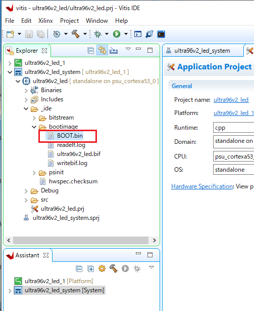

# Ultra96V2のPLでLEDチカを行う(VitisのHello worldから起動編)

# はじめに
[Ultra96V2](https://www.avnet.com/wps/portal/japan/products/product-highlights/ultra96/) で PL から LED を光らせるいわゆるLチカ記事です。

# 前提
まず別記事の[Ultra96V2用にPLでLEDチカを行うbitstreamを作る](https://ho9g75yotmbpkjfj.qrunch.io/entries/pr9UyKzOjTgKbieb)にてLチカを行うbitstreamができるところまで準備ができていることが前提の記事となります。

# 環境
今回はこんな環境で行っています。

- Vivado 2019.2
- Vitis 2019.2
- Windows10マシン

# Vivadoからハードウェア情報をエクスポート
まず、[先の記事](https://ho9g75yotmbpkjfj.qrunch.io/entries/pr9UyKzOjTgKbieb)の Vivado プロジェクトから、「File」->「Export」->「Export Hardware」を選びます。

次に、ダイアログが出てきますので include bitstream にチェックを付けて、ultra96v2_led という名前で OK を押します。

指定した出力先に ultra96v2_led.xsa というファイルが出来ていることを確認します。

ultra96v2_led.xsa には、Vivadoで設定したPS部分の設定や、合成したbitstreamなど様々な情報が含まれています。

# Vitis で起動イメージを作る
まず Vitis を起動すると、ワークスペースの場所を聞いてきますので適当な場所を指定して Launch を押します。

起動したら Create Application Project を選びます。

Project name を入力して Nextを押します。今回は ultra96v2_led としました。

Platform 選択画面になるので Create a new platform from hardware(XSA) タブを選びます

＋ボタンを押して新規にXSAファイルを指定します。

ファイル選択ダイアログが出るので先ほど Vivado で export した ultra96v2_led.xsa を選びます。

新しく ultra96v2_led[custom] というプラットフォームが出てくるので、選択して Next を押します。

Domain選択が出てきますが、今回は Cortex-A53 に standalone で問題ないのでそのまま Next を押します。

Template の選択が出てくるので Hello World を選び、Finishを押します。

ultra96v2_led というプロジェクトが出来上がるので、右クリックして「Build Project」を選んでビルドします。

しばらく待つとビルドが完了するので、今度は「Create Boot Image」を選びます。

このようなダイアログが表示されます。

Boot image partition の部分がイメージの中身になります。
- xsaの情報に基づく初期化と初期ブートを行うFSBL(first step boot loder)
- Vivadoで生成したLEDチカするbitstream
- "Hello world"をシリアルに出力するプログラム
が含まれます。
「Create Image」ボタンを押すと BOOT.BIN というイメージが生成されます。

BOOT.BINをフォーマット済みの micro SDカードにコピーしてください。

今回は BOOT.BIN １つだけあればOKです。

# ボード起動
microSDカードをUltra96V2本体に取り付けて、起動ボタンを押してください。

LEDの点滅が確認できれば成功です。

